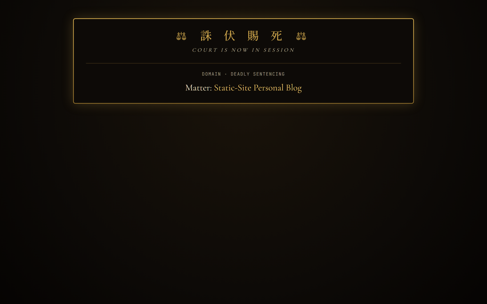
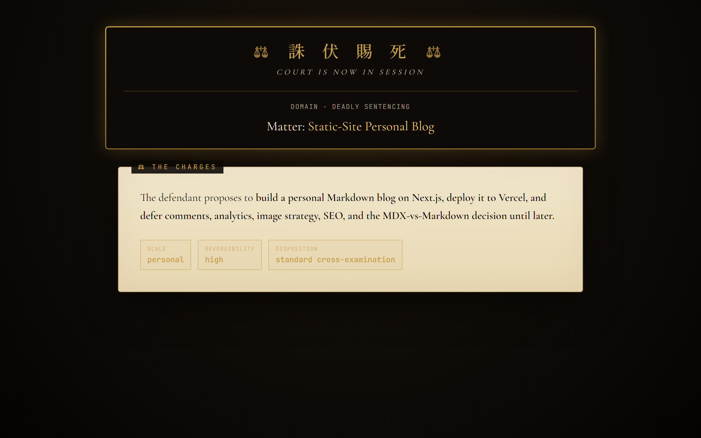
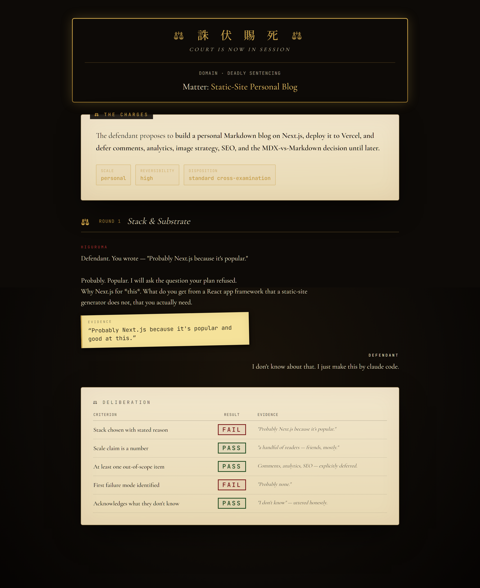
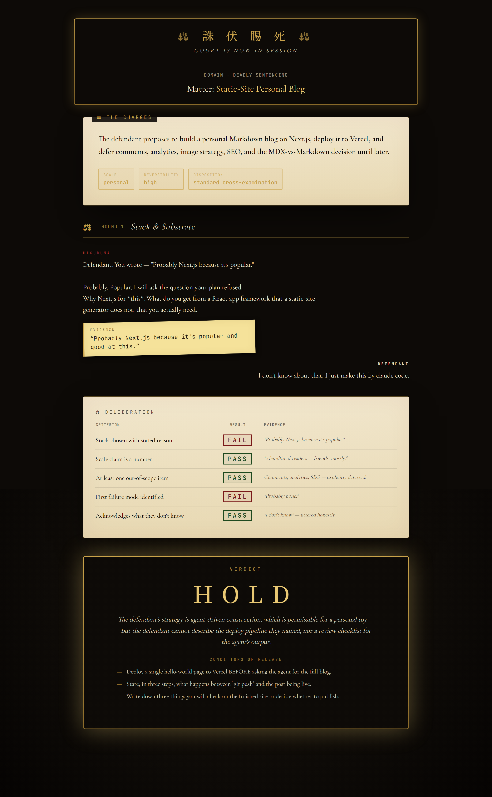
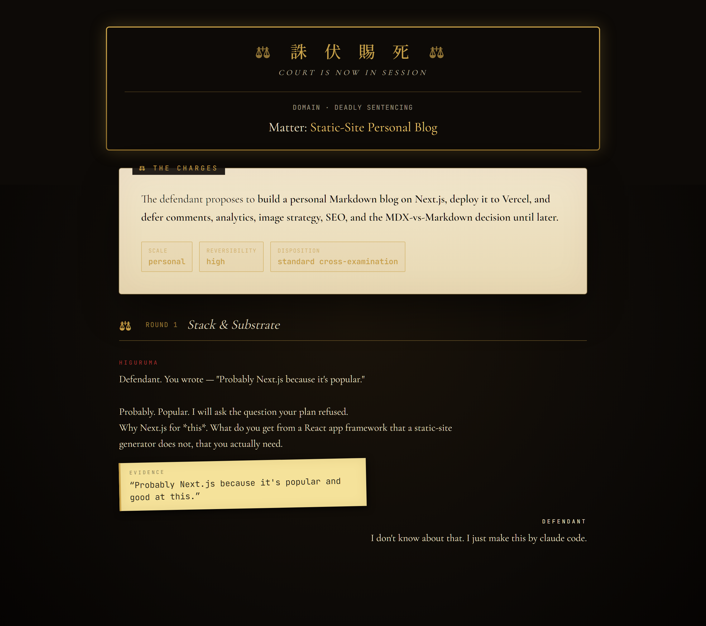

<div align="center">

# 誅　伏　賜　死

<sub>**THE  COURT  OF  JUDGEMENT**</sub>

<sup>*Domain ・ Deadly Sentencing*</sup>

<br />

<a href="https://github.com/papago2355/The-Court-of-Judgement">
  
</a>
&nbsp;

&nbsp;

&nbsp;

&nbsp;


<br /><br />

<table>
  <tr>
    <td align="center" width="50%">
      <br/>
      <sub><i>the matter is announced — gilt frame, kanji, docket</i></sub>
    </td>
    <td align="center" width="50%">
      <br/>
      <sub><i>charges unfurl on parchment with scale &amp; reversibility chips</i></sub>
    </td>
  </tr>
  <tr>
    <td align="center" width="50%">
      <br/>
      <sub><i>scoring stamps punch in row-by-row, PASS / FAIL</i></sub>
    </td>
    <td align="center" width="50%">
      <br/>
      <sub><i>verdict reveal — gilt frame, gavel hit, conditions of release</i></sub>
    </td>
  </tr>
</table>

</div>

<br />

> *"The defendant will state their case.  Testimony that cannot be defended  
> is not testimony — it is wishful thinking."*  
> &nbsp;&nbsp;&nbsp;— Hiromi Higuruma

<br />

---

<h2 align="center"> ⚖ &nbsp;  THE  DOMAIN </h2>

A Claude Code skill that opens a **courtroom around your plan** and forces you to defend it before any code is written. The model is split into two officers of the court — **Higuruma** the cross-examiner and **Judgeman** the impartial judge — and *you*, the user, are the **defendant**.

If you cannot testify on your own behalf, the model will not let you proceed. Not as punishment — as a diagnostic. *An idea you cannot defend is one you do not yet understand well enough to build.*

The skill ships **two render paths**:

|  | Surface | Setup |
|---|---|---|
| **Markdown mode** | The trial unfolds in the Claude Code chat — bold speakers, blockquoted evidence, scoring tables, verdict box. | None. Always available. |
| **Cinematic mode** | A local browser tab mirrors the trial: animated banner, parchment charges, dialogue with quoted-evidence sticky notes, scoring stamps that punch in row-by-row, gavel-hit verdict reveal in a gilt frame. | Optional — install one Python package, restart Claude Code. |

You testify in the Claude Code chat as you normally would. Each line you submit is relayed by the model into the courtroom UI as defendant testimony — your words appear on the witness stand, Higuruma's quoted evidence is pinned to the dais as a sticky note, and the trial advances. The chat is the input surface; the browser is the always-up-to-date mirror.

<div align="center">
<br/>
<sub><i>Higuruma quoting the defendant's own words as evidence — the defendant's reply appears on the witness stand</i></sub>
</div>

<br />

---

<h2 align="center"> ⚖ &nbsp;  THE  FOUR  VERDICTS </h2>

<div align="center">

|   | Ruling | Imperial parallel | Meaning |
|---|---|---|---|
|  | Acquittal | The sword is granted | Testimony is sound. Proceed to implementation. |
|  | Confiscation | The technique is bound | Testimony is incomplete. Specific gaps must be filled before retrial. |
|  | Death Penalty | Sentenced | Concept is fundamentally flawed for the defendant's current capability. |
|  | Severance | Tried in fragments | The plan is too large to try as one case; a smaller sub-question is named. |

</div>

Verdicts can be **stamped to the top of `.md` plan files** as an append-only judicial record. Future sessions inherit the warnings.

<br />

---

<h2 align="center"> ⚖ &nbsp;  QUICK  START </h2>

**Requirements** — Claude Code, Python 3.10+, and (optionally) Node.js 18+ if you intend to modify the cinematic UI itself.

```sh
# 1. Clone the repository.
git clone https://github.com/papago2355/The-Court-of-Judgement.git
cd The-Court-of-Judgement

# 2. The markdown skill works immediately — no install required.
#    Open Claude Code in this directory and run:
#       /judgement examples/easy-tictactoe.md

# 3. To enable the cinematic UI, install the MCP server.
python -m pip install -e mcp-server
cp .mcp.json.example .mcp.json     # Windows: Copy-Item .mcp.json.example .mcp.json

# 4. Restart Claude Code, then try a real trial.
#    /judgement examples/medium-blog.md
#    A browser tab opens at http://localhost:9876
```

> If `python` is not on your `PATH`, use `python3` (macOS / Linux) or your full interpreter path. See [**Cross-platform notes**](#cross-platform-notes) below.

<br />

---

<h2 align="center"> ⚖ &nbsp;  HOW  TO  INVOKE </h2>

In Claude Code, anywhere inside this project's directory:

```
/judgement                              # opens court on the current discussion
/judgement examples/medium-blog.md       # opens court on a specific .md plan
```

Or in natural language: *"open court on this plan"*, *"judge this idea"*, *"convince me this is sound"*, *"trial this"*. The skill self-triggers when an `.md` plan is presented for review before implementation.

### Test fixtures

The verdict difficulty should scale with the plan's ambition. The provided fixtures form the closest thing to a regression suite:

<div align="center">

| Plan | Expected verdict |
|---|:---:|
| `examples/easy-tictactoe.md` |  in one short round |
| `examples/medium-blog.md` |  — gaps in scope and stack rationale |
| `examples/hard-llm-chat.md` |  without real engineering testimony |

</div>

If the easy plan gets HOLD or the hard plan gets APPROVE without serious defense, calibration is off.

<br />

---

<h2 align="center"> ⚖ &nbsp;  HOW  IT  WORKS </h2>

One process, two faces. The MCP server runs as a single Python process that exposes both the **MCP tool layer** (over stdio, for Claude Code) and a **local HTTP + WebSocket server** (for the browser). Tool calls push events onto a thread-safe bus. WebSocket clients receive the full event history on connect — refreshing the tab replays the trial.

```
┌──────────────────────┐    stdio (MCP)     ┌────────────────────────────┐
│   Claude Code        │ ◀────────────────▶│  judgement-mcp  (Python)   │
│   (chat surface)     │                    │   ┌─────────────────────┐  │
└──────────────────────┘                    │   │  FastMCP tools      │  │
                                            │   └──────────┬──────────┘  │
                                            │      events broadcast      │
                                            │              ▼             │
                                            │   ┌─────────────────────┐  │
                                            │   │  Trial event bus    │  │
                                            │   └──────────┬──────────┘  │
                                            │              ▼             │
                                            │   ┌─────────────────────┐  │
                                            │   │  FastAPI + uvicorn  │  │
                                            │   │  :9876   /  + /ws   │  │
                                            │   └──────────┬──────────┘  │
                                            └──────────────┼─────────────┘
                                                           │ HTTP + WS
                                                           ▼
                                                  ┌────────────────────┐
                                                  │  React courtroom   │
                                                  │  (user's browser)  │
                                                  └────────────────────┘
```

The skill auto-detects whether the MCP tools are present in the session and branches to the appropriate render path. **No setup is required for the markdown trial to work**; the cinematic UI is purely additive.

<br />

---

<h2 align="center"> ⚖ &nbsp;  PROJECT  LAYOUT </h2>

```
The-Court-of-Judgement/
├── .claude/skills/judgement/        # the skill (project-scoped)
│   ├── SKILL.md                     #   trial protocol; auto-detects MCP server
│   └── references/
│       └── personas.md              #   voice references for Higuruma & Judgeman
├── mcp-server/                      # Python MCP server + bundled UI (optional)
│   ├── judgement_mcp/
│   │   ├── server.py                #   FastMCP + FastAPI; serves the SPA at :9876
│   │   ├── __main__.py              #   `python -m judgement_mcp` entry
│   │   └── web/                     #   built React bundle (committed)
│   │       └── sounds/              #   drop CC0 audio here (optional)
│   ├── pyproject.toml
│   └── smoke_test.py                #   drive a full trial without Claude Code
├── web/                             # frontend source (Vite + React + TS)
├── examples/                        # test fixtures
│   ├── easy-tictactoe.md
│   ├── medium-blog.md
│   └── hard-llm-chat.md
├── view_example/                    # README screenshots
├── .mcp.json.example                # copy to .mcp.json to enable cinematic mode
├── INSTRUCTION.md                   # original concept brief
└── README.md
```

<br />

---

<h2 align="center" id="cross-platform-notes"> ⚖ &nbsp;  CROSS-PLATFORM  NOTES </h2>

The MCP server is pure Python; the bundled UI is **pre-built and ships with the package**. End users do not need Node.js to run the cinematic trial.

<div align="center">

| Platform | Install command | Config command |
|---|---|---|
| **Windows** *(PowerShell)* | `python -m pip install -e mcp-server` | `Copy-Item .mcp.json.example .mcp.json` |
| **macOS** | `python3 -m pip install -e mcp-server` | `cp .mcp.json.example .mcp.json` |
| **Linux** | `python3 -m pip install -e mcp-server` | `cp .mcp.json.example .mcp.json` |

</div>

If your platform's Python is named `python3`, update `.mcp.json` accordingly:

```json
{
  "mcpServers": {
    "judgement": {
      "command": "python3",
      "args": ["-m", "judgement_mcp"]
    }
  }
}
```

If you keep multiple Python versions, pin the absolute path of the interpreter to be safe:

```json
{ "command": "C:\\Python313\\python.exe", "args": ["-m", "judgement_mcp"] }
```

### Using a virtual environment (recommended)

```sh
python -m venv .venv
# Windows:        .venv\Scripts\activate
# macOS / Linux:  source .venv/bin/activate

python -m pip install -e mcp-server
```

When you install into a venv, point `.mcp.json` at the venv interpreter explicitly so Claude Code finds it regardless of which shell launches it:

```json
{ "command": "/abs/path/to/.venv/bin/python", "args": ["-m", "judgement_mcp"] }
```

### Verifying the install

```sh
# Smoke test — drives the full UI without Claude Code in the loop.
cd mcp-server
python smoke_test.py
# then open http://localhost:9876
```

In Claude Code, run `/mcp` to confirm the **judgement** server is connected with **7 tools**. If it shows a connection error, click the entry to read stderr — most often it's a Python-not-on-PATH or wrong-interpreter issue, both fixed by the absolute-path form above.

<br />

---

<h2 align="center"> ⚖ &nbsp;  SOUND <sub><i>(optional)</i></sub> </h2>

The cinematic UI looks for three audio files under `mcp-server/judgement_mcp/web/sounds/`:

<div align="center">

| File | Played when |
|---|---|
| `gavel.mp3` | Verdict reveal |
| `bell.mp3` | Each scoring row stamps in |
| `courtroom.mp3` | Looping ambient murmur (~3 seconds, fades cleanly) |

</div>

These are **not bundled** — keeps the repository small, avoids licensing entanglements. Source CC0 audio from [Freesound](https://freesound.org), Pixabay, or Mixkit and drop the files in. If they're missing, the trial is silent and everything else still works.

> The first interaction with the page (clicking the splash) is required to unlock audio playback. This is a browser security rule, not a project quirk; `Splash.tsx` exists to satisfy it.

<br />

---

<h2 align="center"> ⚖ &nbsp;  DEVELOPMENT </h2>

### Modifying the trial protocol

Edit [`.claude/skills/judgement/SKILL.md`](./.claude/skills/judgement/SKILL.md). The skill is reloaded on each Claude Code session, so changes take effect on next launch. **Keep both render paths working** — markdown mode is the always-available fallback.

### Modifying the cinematic UI

Node.js 18+ is required for this.

```sh
cd web
npm install        # first time only
npm run dev        # vite dev server at :5173 with WS proxy to :9876
```

To run the dev frontend against a live backend, in another terminal:

```sh
cd mcp-server
python smoke_test.py
```

The dev server proxies `/ws` and `/health` to the Python server, so HMR works while the trial is being driven.

When you're done, build and copy the bundle into the Python package:

```sh
cd web
npm run build
rm -rf ../mcp-server/judgement_mcp/web/assets ../mcp-server/judgement_mcp/web/index.html
cp -r dist/* ../mcp-server/judgement_mcp/web/
```

The committed `mcp-server/judgement_mcp/web/` directory is **intentionally tracked** — it lets users install and run the cinematic UI without ever installing Node.

### MCP tool surface

<div align="center">

| Tool | Purpose |
|---|---|
| `convene(matter)` | Open the browser tab; announce the matter on the docket. |
| `read_charges(summary, scale, reversibility, disposition)` | Render the parchment charges. |
| `begin_round(number, theme)` | Open a round of cross-examination. |
| `speak(speaker, text, evidence_quote?)` | Render a line of dialogue (`speaker` ∈ `higuruma` &#124; `judgeman` &#124; `defendant`). |
| `deliberate(rows)` | Fill the scoring table (`rows[i] = {criterion, result, evidence}`). |
| `pronounce_verdict(ruling, reason, conditions?, remand?)` | Verdict reveal (`ruling` ∈ `APPROVE` &#124; `HOLD` &#124; `REJECT` &#124; `REMAND`). |
| `adjourn()` | Close the trial — adjournment band. |

</div>

Event types broadcast over WebSocket are documented in [`web/src/lib/events.ts`](./web/src/lib/events.ts).

<br />

---

<h2 align="center"> ⚖ &nbsp;  STANDALONE  SKILL <sub><i>(no MCP, no Node, no Python)</i></sub> </h2>

If you want only the markdown trial — no MCP server, no Node, no Python beyond what Claude Code itself uses — copy just the skill folder into your global skills directory:

```sh
# Linux / macOS
cp -r .claude/skills/judgement ~/.claude/skills/

# Windows (PowerShell)
Copy-Item -Recurse .claude/skills/judgement $HOME/.claude/skills/
```

The skill will then be available in any Claude Code project on your machine.

<br />

---

<h2 align="center"> ⚖ &nbsp;  ORIGINS  &  CREDITS </h2>

See [`INSTRUCTION.md`](./INSTRUCTION.md) for the original concept brief.

The idea is rooted in Hiromi Higuruma's domain expansion *Deadly Sentencing* — 誅伏賜死 — from Gege Akutami's **Jujutsu Kaisen**.

<div align="center">

<br/>
<sub><i>Hiromi Higuruma raises the gavel; Judgeman manifests behind him. <strong>Jujutsu Kaisen</strong>, Gege Akutami.</i></sub><br/>
<sub><sup>Reproduced as reference credit. © Gege Akutami / Shueisha — all rights reserved to the original creator.</sup></sub>

</div>

All credit to Akutami-sensei for the cosmology and to Higuruma for the principle:

> *A person who cannot defend their own case has not yet earned the verdict they want.*

This project is a software-engineering reinterpretation. The model does **not** impose judgement on the defendant. The model **asks the defendant to defend their own idea**. The verdict is a diagnostic of how well they could.

<br />

<div align="center">

[`Domain ・ Deadly Sentencing`](./LICENSE) · MIT

<sub>誅　伏　賜　死</sub>

</div>
